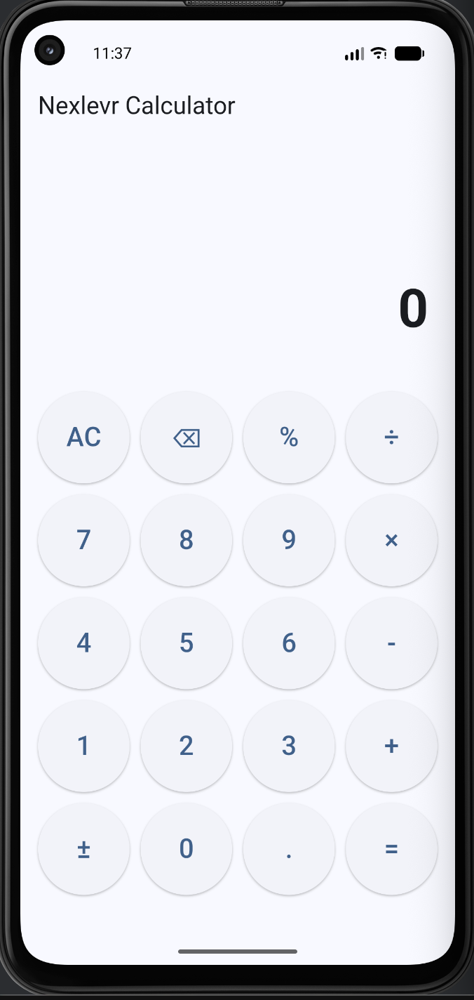
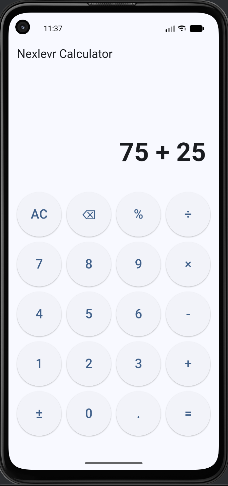
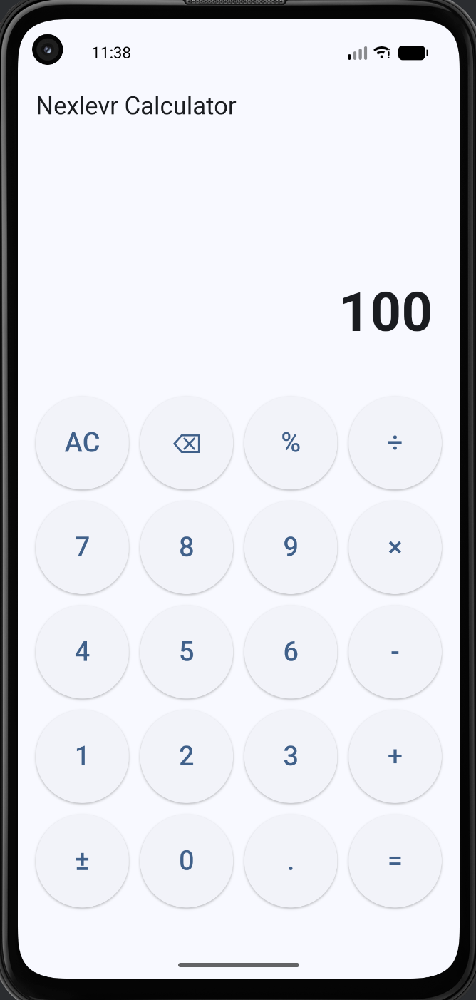

# Nexlevr Calculator 🧮

A simple and user-friendly calculator application built with Flutter and Dart.

## ✨ Features

- Basic arithmetic operations
- Addition, subtraction, multiplication, and division
- Percentage calculation
- Decimal number support
- Positive and negative number conversion
- Clear and backspace functions
- Clean and responsive user interface
- Separate UI and calculation logic
- Cross-platform Flutter project structure

## 🛠️ Technologies Used

- Flutter
- Dart
- Android Studio
- Git
- GitHub

## 📂 Project Structure

```text
lib/
├── LOGIC/
│   └── calculator_logic.dart
├── SCREENS/
│   └── calculator_screen.dart
└── main.dart
```

## 📸 Screenshots

### Calculator Interface



### Calculation



### Result



## 🚀 How to Run

### 1. Clone the repository

```bash
git clone https://github.com/shubhamops36/Nexlevr_calculator.git
```
